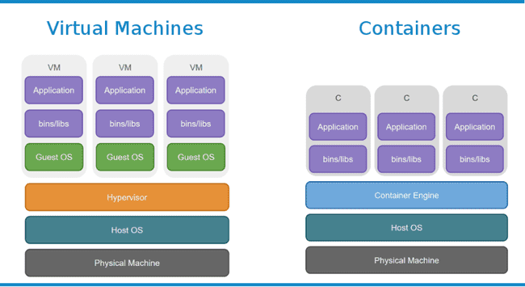
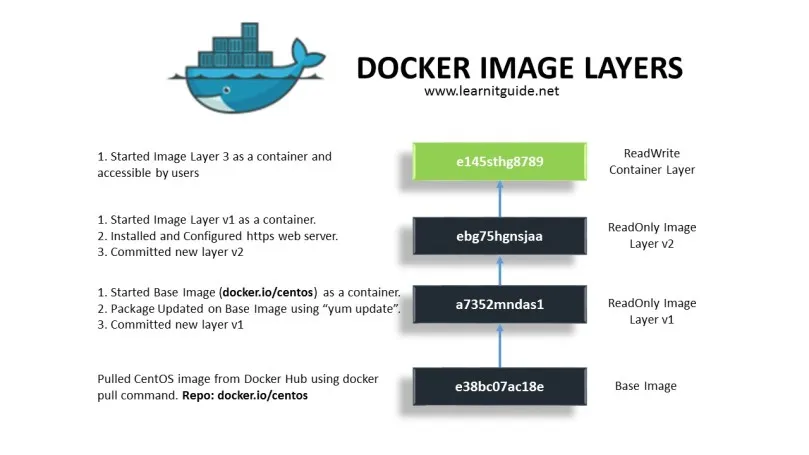
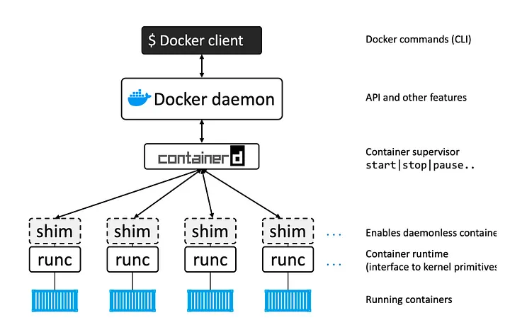

# 1. Docker

**داکر** یک **پلتفرم متن‌باز** برای **ساخت، ارسال و اجرای نرم‌افزار در کانتینرها** است. کانتینرها محیط‌های ایزوله‌ای هستند که شامل همه‌ی وابستگی‌ها و کتابخانه‌های لازم برای اجرای یک برنامه می‌شوند. با استفاده از داکر، می‌توان یک برنامه را روی هر سیستمی بدون نگرانی از وابستگی‌های محیط اجرا کرد.

---

### **چرا داکر؟ مزایای استفاده از آن**  

+ **یکپارچگی و قابل حمل بودن** → می‌توان یک برنامه را روی هر سیستمی اجرا کرد (لپ‌تاپ، سرور، کلود).  
+ **مدیریت وابستگی‌ها** → همه‌ی کتابخانه‌ها و تنظیمات در یک کانتینر قرار دارند.  
+ **ایزوله‌سازی** → هر کانتینر محیط اجرای مخصوص به خود را دارد و به دیگر برنامه‌ها وابسته نیست.  
+ **سرعت بالا** → راه‌اندازی و اجرای برنامه‌ها بسیار سریع‌تر از ماشین‌های مجازی (VMs) است.  
+ **کاربرد گسترده در DevOps** → مناسب برای CI/CD، میکروسرویس‌ها و اجرای برنامه‌ها در محیط‌های مختلف.  

---

## **مقایسه داکر و ماشین مجازی (VMs)**  

| ویژگی | داکر (Docker) | ماشین مجازی (VM) |
|--------|---------------|------------------|
| سرعت | بسیار سریع | کندتر |
| استفاده از منابع | سبک و بهینه | مصرف منابع بالا |
| سیستم‌عامل | از کرنل میزبان استفاده می‌کند | شامل سیستم‌عامل جداگانه است |
| اجرا و مدیریت | ساده و انعطاف‌پذیر | پیچیده‌تر |
| حمل‌پذیری | بسیار بالا | محدودتر |

---



# 2. اجزای اصلی داکر 

۱️⃣ **Docker Engine** → موتور اصلی داکر که کانتینرها را اجرا می‌کند.  
۲️⃣ **Docker Image** → یک بسته‌ی قابل اجرای برنامه که شامل تمام وابستگی‌ها است.  
۳️⃣ **Docker Container** → یک نمونه‌ی در حال اجرا از یک **ایمیج**.  
۴️⃣ **Dockerfile** → یک فایل متنی که مشخص می‌کند چگونه یک ایمیج ساخته شود.  
۵️⃣ **Docker Compose** → ابزاری برای مدیریت چندین کانتینر با یک فایل YAML.  
۶️⃣ **Docker Hub** → یک مخزن عمومی برای اشتراک‌گذاری ایمیج‌های داکر.  

---

- داکر یک فناوری **کانتینری‌سازی** برای اجرای نرم‌افزارها به‌صورت ایزوله است.  
- داکر نسبت به ماشین‌های مجازی **سبک‌تر، سریع‌تر و قابل حمل‌تر** است.  
- **اجزای اصلی داکر** شامل **ایمیج، کانتینر، Dockerfile، Docker Compose** و غیره هستند.  
- با استفاده از **دستورات داکر** می‌توان به‌راحتی کانتینرها را مدیریت کرد.  

در داکر، یک **ایمیج (Image)** شامل **لایه‌های مختلفی** است که هرکدام ویژگی‌ها و وظایف خاص خود را دارند. هر لایه نمایانگر یک تغییر در سیستم فایل است که در فرآیند ساخت ایمیج اعمال می‌شود. این لایه‌ها به طور افزایشی ساخته می‌شوند و به صورت یکپارچه با هم کار می‌کنند.

---
## 2.1 Docker Engine


**Docker Engine** یک پلتفرم **منبع‌باز** است که مسئول اجرای کانتینرها و مدیریت ساخت، ارسال، و اجرای اپلیکیشن‌ها در داکر است. این موتور به‌طور خاص در سیستم‌های لینوکس اجرا می‌شود، اما در ویندوز و مک نیز از طریق **Docker Desktop** قابل استفاده است.

#### **ویژگی‌ها و عملکرد Docker Engine**:

1. **اجرا و مدیریت کانتینرها**:
   - **Docker Engine** مسئولیت ایجاد، راه‌اندازی، مدیریت و نظارت بر کانتینرها را بر عهده دارد. این ابزار شامل یک سرور **Docker Daemon** است که درخواست‌ها را از **CLI** یا **API** دریافت کرده و کانتینرها را مدیریت می‌کند.

2. **معماری Docker Engine**:
   - **Docker Daemon**: پروسه‌ای است که به طور دائمی در پس‌زمینه اجرا می‌شود و درخواست‌های مربوط به ساخت، اجرا و مدیریت کانتینرها را پردازش می‌کند.
   - **Docker CLI**: یک ابزار خط فرمان است که به کاربران این امکان را می‌دهد که دستورات مربوط به داکر را از طریق ترمینال وارد کنند. این ابزار درخواست‌ها را به **Docker Daemon** ارسال می‌کند.
   - **Docker API**: یک رابط برنامه‌نویسی (API) است که به دیگر برنامه‌ها اجازه می‌دهد تا با داکر تعامل داشته باشند.

3. **ایزولاسیون و مدیریت منابع**:
   - **Docker Engine** از ویژگی‌های هسته لینوکس مانند **namespaces** و **cgroups** برای ایزوله کردن کانتینرها و مدیریت منابع سیستم استفاده می‌کند. این باعث می‌شود که هر کانتینر بتواند به طور مستقل اجرا شود و به منابع سیستم به صورت اشتراکی دسترسی داشته باشد.

4. **پشتیبانی از Docker Compose و Kubernetes**:
   - **Docker Engine** از **Docker Compose** برای مدیریت چند کانتینر به صورت هم‌زمان پشتیبانی می‌کند.
   - همچنین می‌توان از **Kubernetes** برای مدیریت کانتینرها در محیط‌های بزرگ‌تر استفاده کرد.

5. **محیط‌های مختلف**:
   - **Docker Engine** به طور مستقیم روی سیستم‌عامل‌های لینوکس نصب می‌شود. اما برای سیستم‌های ویندوز و مک، داکر از **Docker Desktop** استفاده می‌کند که در حقیقت شامل **Docker Engine** است.

6. **پشتیبانی از Docker Hub**:
   - **Docker Engine** می‌تواند به **Docker Hub** یا دیگر رجیستری‌ها برای دانلود و آپلود ایمیج‌ها متصل شود.

#### **محدودیت‌ها**:
- **Docker Engine** به طور پیش‌فرض تنها بر روی سیستم‌عامل‌های لینوکس اجرا می‌شود و برای اجرا در ویندوز و مک نیاز به استفاده از ابزارهایی مانند **Docker Desktop** یا **Hyper-V** دارد.

---

### **مقایسه بین Docker Desktop و Docker Engine**:

| ویژگی                | **Docker Desktop**                                          | **Docker Engine**                                             |
|----------------------|-------------------------------------------------------------|--------------------------------------------------------------|
| **سیستم‌عامل‌های پشتیبانی‌شده** | ویندوز و مک                                                | لینوکس (و در ویندوز و مک از Docker Desktop استفاده می‌شود)   |
| **نصب و پیکربندی**     | نصب آسان با رابط گرافیکی و شامل Docker Engine و Docker Compose | نصب داکر به طور مستقیم بر روی سیستم لینوکس                     |
| **مدیریت کانتینر**     | داشبورد گرافیکی برای مدیریت کانتینرها، ایمیج‌ها و شبکه‌ها  | مدیریت از طریق خط فرمان یا API                              |
| **پشتیبانی از Kubernetes** | پشتیبانی داخلی از Kubernetes برای توسعه محلی            | پشتیبانی از Kubernetes با نصب جداگانه یا از طریق ابزارهای دیگر |
| **مناسب برای استفاده در تولید** | مناسب برای توسعه و تست                                   | مناسب برای تولید و استفاده در سرورهای مقیاس‌پذیر              |

---

# 3. ساختار و لایه‌های یک داکر ایمیج



هر ایمیج داکر از چندین **لایه (Layer)** تشکیل شده است که به صورت **افزایشی** و **غیربازیافت‌پذیر** (Immutable) ایجاد می‌شوند. این لایه‌ها از هم جدا هستند، اما وقتی یک کانتینر از ایمیج ساخته می‌شود، این لایه‌ها در کنار هم ترکیب می‌شوند تا سیستم فایل کانتینر را تشکیل دهند.

---

## **۱. لایه‌های پایه (Base Layers)**
لایه‌های پایه شامل **سیستم‌عامل** و ابزارهای اصلی هستند که برای ساخت برنامه نیاز دارید. این لایه‌ها به عنوان پایه برای لایه‌های بعدی استفاده می‌شوند.  

🔹 **مثال**: وقتی یک داکر ایمیج می‌سازید که از **Ubuntu** به عنوان سیستم‌عامل پایه استفاده می‌کند، لایه اول شامل تمام فایل‌ها و ابزارهای پایه‌ای است که در سیستم‌عامل Ubuntu وجود دارند.

---

## **۲. لایه‌های نصب برنامه‌ها (Application Layers)**
در این لایه‌ها، هر دستور `RUN` که در فایل `Dockerfile` نوشته می‌شود، باعث ایجاد یک لایه جدید می‌شود. این دستورات معمولا شامل نصب برنامه‌ها، کتابخانه‌ها و وابستگی‌های مختلف است.  

🔹 **مثال**: اگر شما از دستور `RUN apt-get install -y python3` در Dockerfile استفاده کنید، یک لایه جدید ایجاد می‌شود که شامل **نصب Python3** است.

---

## **۳. لایه‌های تنظیمات (Configuration Layers)**
در این لایه‌ها، **تنظیمات پیکربندی** (مانند فایل‌های کانفیگ) اضافه می‌شوند. این دستورات معمولا شامل استفاده از دستور `COPY` یا `ADD` برای کپی فایل‌های پیکربندی به کانتینر هستند.  

🔹 **مثال**: اگر شما فایل پیکربندی `config.json` را به کانتینر اضافه کنید، این فایل به عنوان یک لایه جدید ذخیره می‌شود.

---

## **۴. لایه‌های تغییرات در دایرکتوری‌ها (Filesystem Changes)**
لایه‌ها ممکن است به تغییرات در سیستم فایل اشاره کنند، مانند **ایجاد، حذف یا ویرایش فایل‌ها و دایرکتوری‌ها**.  

🔹 **مثال**: دستور `RUN mkdir /app` یک لایه جدید می‌سازد که شامل یک دایرکتوری به نام `/app` است.

---

## **۵. لایه‌های متا دیتا (Metadata Layers)**
این لایه‌ها شامل **اطلاعات متا** هستند که به داکر برای مدیریت کانتینر کمک می‌کنند. این اطلاعات می‌تواند شامل دستوراتی مثل `EXPOSE`، `ENV` یا `CMD` باشد که به ترتیب برای **پورت‌های باز**، **تنظیمات محیطی** و **دستور اجرای پیش‌فرض** استفاده می‌شوند.

🔹 **مثال**:  
- `EXPOSE 8080` یک لایه جدید می‌سازد که داکر را مطلع می‌کند که کانتینر باید پورت 8080 را باز کند.  
- `ENV` به شما این امکان را می‌دهد که متغیرهای محیطی را تنظیم کنید.  

---

## **ویژگی‌های کلیدی لایه‌ها در داکر ایمیج**
### **۱. لایه‌های فقط خواندنی (Read-Only Layers)**  
تمام لایه‌ها به صورت **فقط خواندنی** هستند و نمی‌توانند تغییر کنند. هر لایه تنها شامل تغییرات اعمال‌شده در فرآیند ساخت ایمیج است.

### **۲. کش (Caching) لایه‌ها**
داکر برای **افزایش سرعت** ساخت ایمیج‌ها از **کش** استفاده می‌کند. وقتی یک دستور در Dockerfile مشابهی تکرار می‌شود، داکر از لایه‌های کش شده برای جلوگیری از اجرای دوباره دستور استفاده می‌کند. این ویژگی می‌تواند زمان ساخت ایمیج‌ها را کاهش دهد.

### **۳. لایه‌های غیربازیافت‌پذیر**
لایه‌ها قابل تغییر نیستند و در صورت تغییر در دستور در Dockerfile (حتی اگر تغییرات کوچکی اعمال شود)، داکر باید لایه‌های جدیدی بسازد.

---

## **مزایای لایه‌ها**
- **اشتراک‌گذاری لایه‌ها**: لایه‌های مشترک بین ایمیج‌ها می‌توانند به اشتراک گذاشته شوند، که باعث کاهش مصرف حافظه و ذخیره‌سازی می‌شود.
- **صرفه‌جویی در زمان**: لایه‌ها به داکر این امکان را می‌دهند که فقط تغییرات جدید را اعمال کند، بنابراین سرعت ساخت ایمیج‌های جدید افزایش می‌یابد.

---

## **نحوه مشاهده لایه‌های یک داکر ایمیج**
برای مشاهده لایه‌های یک ایمیج داکر، می‌توانید از دستور `docker history` استفاده کنید:

```bash
docker history <image_name>
```
این دستور به شما نشان می‌دهد که **هر لایه** چه دستوری را اجرا کرده و حجم آن چقدر است.


این دستور نمایش می‌دهد که هر لایه شامل چه تغییراتی بوده است. در نتیجه، چیزی مشابه به این نمایش داده خواهد شد:

```bash
docker history postgres
```

```bash
IMAGE          CREATED        CREATED BY                                      SIZE      COMMENT
a7f7a0b1b0f5   2 weeks ago    /bin/sh -c #(nop)  ENV POSTGRES_PASSWORD=secret   0B        buildkit.dockerfile.v0
4f41745d1cfe   2 weeks ago    /bin/sh -c #(nop)  EXPOSE 5432                   0B        buildkit.dockerfile.v0
9c02b8e5125b   2 weeks ago    /bin/sh -c #(nop) COPY file:399dd5121e2b26a937…   35.9MB    buildkit.dockerfile.v0
7a7a3d3659fa   2 weeks ago    /bin/sh -c #(nop) COPY file:312de36b2c2e15fd53…   9.84MB    buildkit.dockerfile.v0
d0d84ed5c989   2 weeks ago    /bin/sh -c #(nop) COPY file:4ff8a1e9d98bafeb5d…   58.3MB    buildkit.dockerfile.v0
7f12ab3120f9   2 weeks ago    /bin/sh -c #(nop) COPY file:2c7a7c34d0b78ec7e0…   85.9MB    buildkit.dockerfile.v0
9f0c8b2b2d71   2 weeks ago    /bin/sh -c #(nop) COPY file:b93568cd4fbb4caef5…   20.6MB    buildkit.dockerfile.v0
...
```

### توضیح لایه‌ها در این مثال:

1. **لایه اول: `ENV POSTGRES_PASSWORD=secret`**  
   این لایه مربوط به تنظیمات محیطی است که پسورد پیش‌فرض PostgreSQL را تعیین می‌کند. این لایه هیچ‌گونه فضای ذخیره‌سازی را به طور خاص مصرف نمی‌کند (`0B`).

2. **لایه دوم: `EXPOSE 5432`**  
   این لایه مربوط به باز کردن پورت **5432** است که پورت پیش‌فرض PostgreSQL برای ارتباط است.

3. **لایه‌های بعدی: `COPY`**  
   این لایه‌ها فایل‌های مختلفی را که در Dockerfile آمده، به ایمیج اضافه می‌کنند. این فایل‌ها می‌توانند شامل اسکریپت‌ها، داده‌های پیکربندی یا دیگر فایل‌های مورد نیاز برای اجرای PostgreSQL باشند.

---

# 4. Docker Client
**Docker Client** به برنامه‌ای اطلاق می‌شود که با **Docker Daemon** (موتور داکر) ارتباط برقرار می‌کند و دستورات داکر را اجرا می‌کند. این کلاینت مسئول ارسال درخواست‌ها به داکر دیمون و دریافت پاسخ‌ها است. در حقیقت، **Docker Client** رابط کاربری است که شما برای تعامل با سیستم داکر استفاده می‌کنید.

#### **ویژگی‌ها و عملکردهای Docker Client**:
- **دستورات Docker** را دریافت و به **Docker Daemon** ارسال می‌کند.
- می‌تواند به صورت محلی یا از راه دور با **Docker Daemon** ارتباط برقرار کند.
- دستورات معمول شامل `docker run`, `docker ps`, `docker build`, `docker stop`, و غیره هستند.
- معمولا در خط فرمان (CLI) استفاده می‌شود، ولی ممکن است در **API**ها و برنامه‌های گرافیکی نیز مورد استفاده قرار گیرد.

#### **نحوه تعامل با Docker Daemon**:
- وقتی شما دستوری مانند `docker run` را وارد می‌کنید، این دستور به **Docker Client** ارسال می‌شود.
- سپس **Docker Client** این درخواست را به **Docker Daemon** ارسال می‌کند.
- پس از اجرای دستورات در Docker Daemon، نتیجه به **Docker Client** برمی‌گردد و به شما نمایش داده می‌شود.

---

# 5. Docker Daemon
**Docker Daemon** یا **dockerd**، قلب سیستم داکر است که مسئول اجرای کانتینرها، مدیریت ایمیج‌ها، شبکه‌ها، و دیگر عملیات‌های مرتبط با داکر می‌باشد. این سرویس به طور پیش‌فرض در پس‌زمینه اجرا می‌شود و درخواست‌ها را از **Docker Client** یا از طریق API دریافت می‌کند.

#### **ویژگی‌ها و عملکردهای Docker Daemon**:
- **مدیریت کانتینرها**: مسئول ایجاد، حذف، اجرا و متوقف کردن کانتینرها است.
- **مدیریت ایمیج‌ها**: داکر دیمون ایمیج‌های جدید را از فایل‌های Dockerfile می‌سازد و آن‌ها را در مخازن ذخیره می‌کند.
- **مدیریت شبکه‌ها و حجم‌ها (Volumes)**: ایجاد و مدیریت شبکه‌های داکر و همچنین حجم‌ها برای ذخیره داده‌ها.
- **دریافت درخواست‌ها از Docker Client**: درخواست‌های ارسال‌شده از Docker Client را پردازش و اجرا می‌کند.

#### **ویژگی‌های کلیدی**:
- داکر دیمون معمولاً در پس‌زمینه اجرا می‌شود و به صورت مداوم به درخواست‌های ورودی پاسخ می‌دهد.
- داکر دیمون می‌تواند بر روی یک سیستم محلی یا به صورت **دورکاری** (Remote) اجرا شود.
- از **API** برای ارتباط با سایر سرویس‌ها و سیستم‌ها استفاده می‌کند.

---

# 6. containerd
**containerd** یک **رابط اجرایی سطح پایین** است که برای اجرای کانتینرها به طور مستقل از Docker طراحی شده است. این ابزار از طرف داکر پشتیبانی می‌شود و برای مدیریت چرخه حیات کانتینرها، از جمله راه‌اندازی، نظارت، و توقف آن‌ها به کار می‌رود.

#### **ویژگی‌ها و عملکردهای containerd**:
- **مدیریت اجرای کانتینرها**: به طور مستقیم مسئول اجرای کانتینرها است، نه فقط ساخت یا مدیریت آن‌ها.
- **انتقال لایه‌ها**: انتقال لایه‌های داکر به سیستم فایل کانتینر.
- **مدیریت تصاویر**: قادر به مدیریت و ذخیره‌سازی تصاویر کانتینر و تأمین منابع مورد نیاز برای اجرای آن‌ها است.
- **زیرساخت کانتینر**: از استانداردهای **OCI (Open Container Initiative)** برای مدیریت کانتینرها استفاده می‌کند.

#### **ارتباط با Docker Daemon**:
- در حالی که **Docker Daemon** برای مدیریت اجزای سطح بالا مانند شبکه‌ها و حجم‌ها و سایر فرآیندهای کلیدی داکر استفاده می‌شود، **containerd** به عنوان ابزار **مستقل‌تر و سطح پایین‌تر** برای اجرای خود کانتینرها عمل می‌کند.
- **Docker Daemon** از **containerd** برای مدیریت مراحل اجرایی کانتینرها و منابع زیرساختی استفاده می‌کند.
- **containerd** به طور خاص برای اجرای کانتینرها طراحی شده و از قابلیت‌های اصلی داکر به شمار می‌آید، اما می‌تواند به طور مستقل نیز مورد استفاده قرار گیرد.

#### **مزایا**:
- **مقیاس‌پذیری بیشتر**: با توجه به اینکه containerd به طور مستقل از داکر کار می‌کند، این امکان را می‌دهد که از آن در پروژه‌های دیگر مانند **Kubernetes** برای مدیریت کانتینرها استفاده کنید.
- **سادگی و عملکرد بالا**: به دلیل معماری ساده‌تر و سطح پایین‌تر، containerd می‌تواند از نظر کارایی بهتر از داکر عمل کند.

---

# 7. نحوه تعامل: containerd & docker client & docker daemon



- **Docker Client** دستورات را از کاربر دریافت کرده و آن‌ها را به **Docker Daemon** ارسال می‌کند.
- **Docker Daemon** این دستورات را پردازش کرده و به **containerd** ارجاع می‌دهد تا کانتینرها ایجاد و اجرا شوند.
- **containerd** کانتینرها را به‌طور مستقیم اجرا کرده و چرخه حیات آن‌ها را مدیریت می‌کند.
- پس از اجرای کانتینرها، **Docker Daemon** از **containerd** بازخورد می‌گیرد و نتیجه را به **Docker Client** ارسال می‌کند.

---

- **Docker Client** رابط کاربری است که دستورات را از کاربر دریافت می‌کند و به **Docker Daemon** ارسال می‌کند.
- **Docker Daemon** به عنوان سرویس اصلی داکر، درخواست‌های کلاینت را پردازش کرده و برای اجرای کانتینرها به **containerd** ارجاع می‌دهد.
- **containerd** یک لایه اجرایی سطح پایین است که مستقیماً مسئول اجرای کانتینرها است.

# 8. runc

**runc** یک ابزار خط فرمان سبک و کم‌حجم است که به عنوان **اجرای کانتینرها** در سیستم‌های لینوکسی عمل می‌کند. این ابزار توسط پروژه **Open Container Initiative (OCI)** توسعه داده شده است و برای اجرای کانتینرها بر اساس استانداردهای **OCI** استفاده می‌شود.

**runc** در واقع لایه‌ای است که **containerd** برای اجرای کانتینرها از آن استفاده می‌کند. به عبارت دیگر، **containerd** مسئولیت مدیریت چرخه حیات کانتینرها را بر عهده دارد، اما برای اجرای واقعی کانتینرها از **runc** استفاده می‌کند.

#### **ویژگی‌ها و عملکردهای runc**:

1. **اجرای کانتینرها**:
   - **runc** وظیفه اجرای کانتینرها را در سیستم‌های لینوکسی بر عهده دارد. این ابزار با استفاده از ویژگی‌های هسته لینوکس، مانند **namespaces** و **cgroups**، کانتینرها را ایزوله کرده و منابع آن‌ها را مدیریت می‌کند.
   
2. **پشتیبانی از OCI**:
   - **runc** به عنوان یک ابزار منبع‌باز و استاندارد از **Open Container Initiative (OCI)** پیروی می‌کند. OCI استانداردهایی برای تعریف و اجرای کانتینرها در نظر گرفته است که باعث سازگاری بیشتر میان ابزارهای مختلف مانند Docker و Kubernetes می‌شود.
   
3. **ساده و کم‌حجم**:
   - یکی از مزایای **runc**، سادگی و سبک بودن آن است. این ابزار تنها به اجرای کانتینرها محدود است و هیچ ویژگی اضافه‌ای مانند مدیریت شبکه یا ذخیره‌سازی ندارد. این ویژگی باعث می‌شود که برای سیستم‌های بزرگ یا محیط‌هایی که نیاز به عملکرد بالا دارند، مناسب باشد.

4. **یکپارچگی با containerd و Docker**:
   - **runc** به عنوان یک ابزار اجرایی پایین‌رده در داخل داکر و **containerd** استفاده می‌شود. در واقع، **containerd** برای مدیریت چرخه حیات کانتینرها از **runc** برای اجرای واقعی کانتینرها بهره می‌برد.
   
5. **فراهم‌آوری ایزولاسیون و مدیریت منابع**:
   - از آنجا که **runc** بر اساس قابلیت‌های هسته لینوکس (مانند **namespaces** و **cgroups**) کار می‌کند، به طور موثر ایزولاسیون و مدیریت منابع را فراهم می‌کند. این ابزار می‌تواند کانتینرها را از یکدیگر ایزوله کرده و منابع مانند CPU، حافظه و I/O را برای هر کانتینر مدیریت کند.

#### **نحوه تعامل runc با دیگر ابزارها**:
- **containerd** از **runc** برای اجرای کانتینرها استفاده می‌کند. **containerd** به عنوان یک ابزار مدیریت کانتینر، مسئولیت‌های بالاتر مانند دانلود ایمیج، پیکربندی شبکه و ذخیره‌سازی را انجام می‌دهد، در حالی که **runc** به طور خاص برای اجرای کانتینرها در سطح سیستم‌عامل استفاده می‌شود.
  
- در **Docker**، به همین ترتیب، زمانی که شما یک کانتینر را با دستور `docker run` اجرا می‌کنید، **Docker Daemon** از **containerd** استفاده می‌کند و در نهایت برای اجرای کانتینر از **runc** بهره می‌برد.

#### **فرآیند اجرای کانتینر توسط runc**:
1. **runc** یک کانتینر را از یک **ایمیج** تعریف‌شده می‌سازد.
2. کانتینر اجرا می‌شود و منابع سیستم (CPU، حافظه و ...) ایزوله می‌شوند.
3. **runc** به صورت مستقیم با **Linux Kernel** ارتباط برقرار می‌کند تا ویژگی‌هایی مانند ایزولاسیون، امنیت و مدیریت منابع را برای کانتینر فراهم کند.
4. پس از اجرای کانتینر، **runc** یک **PID namespace** جدید برای کانتینر ایجاد می‌کند و آن را به فرآیندهای جدید مربوطه متصل می‌کند.

---

### **مقایسه با سایر ابزارها**:
- **runc** در واقع یک ابزار **سطح پایین** برای اجرای کانتینرها است و بیشتر برای استفاده در لایه‌های زیرین مانند **containerd** و **Docker** طراحی شده است.
- ابزارهایی مانند **Docker** و **containerd** از **runc** به عنوان یک لایه اجرایی استفاده می‌کنند و شامل ویژگی‌هایی مانند مدیریت شبکه، ذخیره‌سازی و ایمنی بیشتر هستند که به کاربر این امکان را می‌دهند که بدون نگرانی از جزئیات اجرای کانتینر، از آن‌ها استفاده کنند.

# 9. مراحل اجرای یک ایمیج

وقتی شما دستور `docker run postgres` را اجرا می‌کنید، داکر یک سری مراحل مختلف را طی می‌کند. در اینجا، مراحل مختلف را توضیح می‌دهیم که هر کدام چه اتفاقی می‌افتد.

### مراحل اجرا:
#### 1. **بررسی ایمیج موجود در سیستم**
وقتی دستور `docker run postgres` اجرا می‌شود، ابتدا داکر بررسی می‌کند که آیا ایمیج **PostgreSQL** (که در اینجا به صورت پیش‌فرض از Docker Hub فراخوانی می‌شود) در سیستم موجود است یا خیر.
- اگر ایمیج از قبل دانلود شده باشد، داکر آن را برای اجرای کانتینر استفاده می‌کند.
- اگر ایمیج موجود نباشد، داکر به صورت خودکار آن را از **Docker Hub** دانلود می‌کند.
---
#### 2. **دانلود ایمیج از Docker Hub (در صورت نیاز)**
اگر ایمیج **PostgreSQL** در سیستم موجود نباشد، داکر به **Docker Hub** متصل می‌شود و ایمیج مربوطه را دانلود می‌کند.
- داکر به طور پیش‌فرض ایمیج را از رجیستری رسمی Docker Hub می‌گیرد.
- داکر اطلاعاتی مانند **لایه‌ها** و **تاریخچه‌ی لایه‌های** ایمیج را دانلود می‌کند.
---

#### 3. **ساخت کانتینر از ایمیج**
پس از دانلود ایمیج (یا اگر ایمیج قبلاً در سیستم موجود باشد)، داکر یک **کانتینر** جدید از آن ایمیج می‌سازد.
- داکر کانتینری جداگانه و ایزوله برای اجرای PostgreSQL ایجاد می‌کند.
- کانتینر شامل یک فایل سیستم مخصوص به خود است که از لایه‌های ایمیج ساخته می‌شود.
---

#### 4. **اجرای دستور CMD در Dockerfile ایمیج**
هر ایمیج داکر معمولاً یک دستور **CMD** در فایل Dockerfile خود دارد که تعریف می‌کند پس از شروع کانتینر، چه برنامه‌ای اجرا شود.
- در ایمیج PostgreSQL، دستور **CMD** معمولاً راه‌اندازی سرویس PostgreSQL است. بنابراین، پس از اجرای کانتینر، PostgreSQL شروع به اجرا می‌کند.
- این دستور معمولاً به صورت خودکار در پس‌زمینه اجرا می‌شود و سرویس پایگاه داده PostgreSQL در کانتینر شروع به کار می‌کند.
---

#### 5. **ایجاد شبکه و تنظیمات ایزوله‌سازی**
- داکر به صورت پیش‌فرض یک شبکه **bridge** برای کانتینر ایجاد می‌کند.
- این کانتینر به شبکه‌ای ایزوله شده متصل می‌شود تا از دیگر کانتینرها و منابع سیستم جدا باشد.
- این ایزوله‌سازی باعث می‌شود که کانتینر فقط به منابع و شبکه‌های خود دسترسی داشته باشد، مگر اینکه به صورت خاص پورت‌ها یا دایرکتوری‌ها به بیرون از کانتینر متصل شوند.
---

#### 6. **اجرای کانتینر و راه‌اندازی PostgreSQL**
وقتی کانتینر اجرا می‌شود، PostgreSQL درون کانتینر راه‌اندازی می‌شود.
- PostgreSQL به طور معمول به پورت **5432** گوش می‌دهد و منتظر درخواست‌های اتصال از کلاینت‌ها می‌باشد.
- در این مرحله، سرویس PostgreSQL درون کانتینر در حال اجرا است و آماده پذیرش درخواست‌های دیتابیس است.
---

#### 7. **اتصال کانتینر به پورت‌های سیستم میزبان (اختیاری)**
اگر شما در دستور خود پورت‌های کانتینر را به پورت‌های سیستم میزبان نگنجانده باشید (مثلاً با استفاده از پارامتر `-p`)، سرویس PostgreSQL فقط در داخل کانتینر قابل دسترسی است.
- اگر بخواهید به PostgreSQL از بیرون کانتینر دسترسی پیدا کنید، باید پورت‌ها را با دستور `docker run -p 5432:5432 postgres` باز کنید تا ارتباط بین سیستم میزبان و کانتینر برقرار شود.
- در این صورت، پورت **5432** در سیستم میزبان به پورت **5432** در کانتینر متصل می‌شود و شما می‌توانید از بیرون کانتینر به PostgreSQL دسترسی داشته باشید.
---

#### 8. **مدیریت فرآیندها و ایزولاسیون منابع**
- سیستم داکر منابع (مثل **CPU**، **RAM**، و **Disk I/O**) کانتینر را ایزوله کرده و آن‌ها را از دیگر فرآیندهای سیستم میزبان جدا می‌کند.
- این ایزوله‌سازی به کانتینر اجازه می‌دهد که بدون تداخل با دیگر فرآیندها، به طور مجزا اجرا شود.
---

#### 9. **پایان اجرای کانتینر**
- وقتی کانتینر در حال اجرا است، می‌توانید با استفاده از دستورات مختلف مانند `docker ps` آن را مشاهده کنید.
- در صورت توقف یا حذف کانتینر، فرآیندهای داخل کانتینر متوقف می‌شوند و منابع آن آزاد می‌شود.
- برای توقف کانتینر می‌توان از دستور `docker stop` استفاده کرد و برای حذف کانتینر از `docker rm`.
---

# 10. Dockerfile

### **Dockerfile چیست؟**

**Dockerfile** یک فایل متنی است که شامل دستوراتی است که داکر برای ساخت یک ایمیج جدید باید اجرا کند. این فایل در حقیقت دستورالعمل‌هایی است که مشخص می‌کند چگونه یک ایمیج از یک محیط خاص ساخته شود. هر دستور در Dockerfile یک **لایه** ایجاد می‌کند که در نهایت به یک ایمیج تبدیل می‌شود. به عبارت دیگر، Dockerfile به داکر می‌گوید چگونه یک کانتینر را با تمام وابستگی‌ها، تنظیمات و برنامه‌ها ایجاد کند.

### **ساختار کلی Dockerfile**

یک Dockerfile معمولاً از دستورات مختلفی تشکیل شده است که در زیر توضیح می‌دهیم:

1. **FROM**
2. **RUN**
3. **COPY / ADD**
4. **WORKDIR**
5. **ENV**
6. **EXPOSE**
7. **CMD**
8. **ENTRYPOINT**
9. **VOLUME**
10. **USER**
11. **ARG**
12. **LABEL**

### **1. دستور `FROM`**

دستور **FROM** به داکر می‌گوید که ایمیج پایه‌ای که برای ساخت ایمیج جدید استفاده می‌شود، کدام است. این دستور اولین خط از هر Dockerfile است و می‌تواند به ایمیج‌های موجود در Docker Hub یا یک ایمیج محلی اشاره کند.

مثال:
```Dockerfile
FROM ubuntu:20.04
```
این دستور از ایمیج **ubuntu:20.04** به عنوان پایه برای ساخت ایمیج جدید استفاده می‌کند.

### **2. دستور `RUN`**

دستور **RUN** برای اجرای دستورات در زمان ساخت ایمیج به کار می‌رود. این دستورات به صورت معمول در سیستم‌عامل داخل کانتینر اجرا می‌شوند.

مثال:
```Dockerfile
RUN apt-get update && apt-get install -y python3
```
این دستور سیستم‌عامل داخل کانتینر را به‌روزرسانی کرده و پایتون نسخه 3 را نصب می‌کند.

### **3. دستور `COPY` و `ADD`**

- **COPY** برای کپی کردن فایل‌ها و دایرکتوری‌ها از سیستم میزبان به داخل کانتینر استفاده می‌شود.
- **ADD** مشابه **COPY** است، اما قابلیت‌های بیشتری دارد، مانند استخراج فایل‌های فشرده یا دانلود فایل‌ها از URL.

مثال:
```Dockerfile
COPY ./src /app/src
ADD ./app.tar.gz /app/
```
در اینجا، محتویات دایرکتوری `src` از سیستم میزبان به `/app/src` در کانتینر کپی می‌شود.

### **4. دستور `WORKDIR`**

دستور **WORKDIR** مسیر کاری داخل کانتینر را تنظیم می‌کند. تمامی دستورات بعد از آن به این مسیر اجرا خواهند شد.

مثال:
```Dockerfile
WORKDIR /app
```
این دستور مسیر `/app` را به عنوان مسیر کاری تنظیم می‌کند.

### **5. دستور `ENV`**

دستور **ENV** برای تنظیم متغیرهای محیطی (environment variables) در داخل کانتینر استفاده می‌شود.

مثال:
```Dockerfile
ENV APP_VERSION=1.0
```
این دستور متغیر محیطی به نام `APP_VERSION` را با مقدار `1.0` تنظیم می‌کند.

### **6. دستور `EXPOSE`**

دستور **EXPOSE** برای اعلام پورت‌هایی است که کانتینر در زمان اجرای آن‌ها را باز می‌کند. این دستور اطلاعاتی است و تاثیری روی اجرا ندارد.

مثال:
```Dockerfile
EXPOSE 8080
```
این دستور اعلام می‌کند که پورت **8080** باید برای دسترسی به کانتینر باز باشد.

### **7. دستور `CMD`**

دستور **CMD** مشخص می‌کند که وقتی کانتینر اجرا می‌شود، چه برنامه‌ای باید شروع به کار کند. این دستور معمولاً یک برنامه یا اسکریپت است که باید اجرا شود.

مثال:
```Dockerfile
CMD ["python3", "app.py"]
```
این دستور مشخص می‌کند که وقتی کانتینر شروع به کار می‌کند، اسکریپت `app.py` با استفاده از پایتون اجرا شود.

### **8. دستور `ENTRYPOINT`**

دستور **ENTRYPOINT** مشابه **CMD** است، اما تفاوت آن در این است که **ENTRYPOINT** همیشه اجرا می‌شود و می‌تواند به همراه **CMD** ترکیب شود.

مثال:
```Dockerfile
ENTRYPOINT ["python3"]
CMD ["app.py"]
```
در اینجا، وقتی کانتینر اجرا شود، ابتدا دستور `python3` اجرا خواهد شد و سپس اسکریپت `app.py` به عنوان آرگومان به آن داده می‌شود.

### **9. دستور `VOLUME`**

دستور **VOLUME** یک دایرکتوری مشترک در کانتینر ایجاد می‌کند که می‌تواند به فایل‌سیستم میزبان متصل شود.

مثال:
```Dockerfile
VOLUME ["/data"]
```
این دستور دایرکتوری `/data` را در کانتینر به عنوان یک volume می‌سازد که می‌تواند به سیستم‌های خارجی متصل شود.

### **10. دستور `USER`**

دستور **USER** برای تنظیم کاربری است که کانتینر تحت آن اجرا می‌شود.

مثال:
```Dockerfile
USER postgres
```
این دستور کانتینر را تحت کاربر **postgres** اجرا می‌کند.

### **11. دستور `ARG`**

دستور **ARG** برای تعریف متغیرهای ساختی (build-time variables) استفاده می‌شود که هنگام ساخت ایمیج قابل تنظیم هستند.

مثال:
```Dockerfile
ARG version=1.0
```
این دستور متغیر `version` را با مقدار پیش‌فرض `1.0` تنظیم می‌کند. هنگام ساخت ایمیج می‌توان این متغیر را بازنویسی کرد.

### **12. دستور `LABEL`**

دستور **LABEL** برای اضافه کردن متا‌دیتا به ایمیج داکر استفاده می‌شود. این می‌تواند شامل اطلاعاتی مانند نام، ورژن یا اطلاعات دیگر باشد.

مثال:
```Dockerfile
LABEL version="1.0" description="My custom app"
```
این دستور متا‌دیتای مربوط به ورژن و توضیحات اپلیکیشن را به ایمیج اضافه می‌کند.

---

### **فراخوانی لایه‌ها و متدها**

هر دستور در Dockerfile باعث ایجاد یک **لایه جدید** در ایمیج می‌شود. به عبارت دیگر، Dockerfile به داکر می‌گوید که برای ساخت ایمیج، باید این دستورات را به ترتیب اجرا کند و هر کدام یک لایه جدید را ایجاد کنند. به این ترتیب، هنگام ساخت ایمیج، داکر لایه‌ها را ذخیره کرده و می‌تواند از آن‌ها برای سرعت بخشیدن به فرآیند ساخت مجدد استفاده کند. لایه‌ها به طور مجزا و کش‌شده ذخیره می‌شوند، بنابراین اگر فقط برخی از دستورات تغییر کنند، داکر فقط لایه‌های جدید را ساخته و باقی لایه‌ها را از کش استفاده می‌کند.

---

### **نحوه اجرای Dockerfile**

برای ساخت یک ایمیج از یک Dockerfile، شما می‌توانید از دستور `docker build` استفاده کنید. به این صورت:

1. ابتدا باید فایل Dockerfile را در دایرکتوری خاصی داشته باشید.
2. دستور زیر را برای ساخت ایمیج اجرا کنید:
   ```bash
   docker build -t my-image-name .
   ```
   این دستور به داکر می‌گوید که از Dockerfile موجود در دایرکتوری جاری (`.`) یک ایمیج بسازد و نام ایمیج را `my-image-name` قرار دهد.

---

## 10.1 مثال داکر فایل (`postgresql`)

در اینجا یک مثال از یک **Dockerfile** برای **PostgreSQL** آورده شده است که شامل تمام مراحل لازم برای ساخت یک ایمیج داکر برای PostgreSQL است و در آن متغیرهای محیطی مختلف تنظیم شده است.

### **Dockerfile برای PostgreSQL**:

```Dockerfile
# مرحله 1: استفاده از ایمیج پایه PostgreSQL
FROM postgres:13.3-alpine

# مرحله 2: تعریف متغیرهای محیطی
ENV POSTGRES_USER=myuser
ENV POSTGRES_PASSWORD=mypassword
ENV POSTGRES_DB=mydatabase
ENV POSTGRES_HOST_AUTH_METHOD=trust

# مرحله 3: ایجاد دایرکتوری برای اسکریپت‌های SQL
RUN mkdir -p /docker-entrypoint-initdb.d

# مرحله 4: کپی کردن فایل‌های اسکریپت SQL برای راه‌اندازی پایگاه داده
COPY init.sql /docker-entrypoint-initdb.d/

# مرحله 5: تنظیمات فایل پیکربندی PostgreSQL
COPY postgresql.conf /etc/postgresql/postgresql.conf

# مرحله 6: باز کردن پورت‌های لازم
EXPOSE 5432

# مرحله 7: اجرای دستور initdb برای راه‌اندازی پایگاه داده
CMD ["postgres", "-c", "config_file=/etc/postgresql/postgresql.conf"]
```

### **توضیحات خط به خط:**

#### 1. **FROM postgres:13.3-alpine**
```Dockerfile
FROM postgres:13.3-alpine
```
- **FROM**: این خط نشان‌دهنده پایه ایمیج است. از **postgres:13.3-alpine** استفاده می‌کنیم که یک نسخه سبکتر از PostgreSQL است که بر اساس توزیع Alpine لینوکس ساخته شده است.
- این ایمیج شامل تمام بسته‌ها و تنظیمات مورد نیاز برای اجرای PostgreSQL نسخه ۱۳.۳ است.

#### 2. **تعریف متغیرهای محیطی**
```Dockerfile
ENV POSTGRES_USER=myuser
ENV POSTGRES_PASSWORD=mypassword
ENV POSTGRES_DB=mydatabase
ENV POSTGRES_HOST_AUTH_METHOD=trust
```
- **ENV POSTGRES_USER=myuser**: این متغیر محیطی نام کاربری برای کاربر پیش‌فرض PostgreSQL را تعیین می‌کند.
- **ENV POSTGRES_PASSWORD=mypassword**: این متغیر محیطی رمز عبور برای کاربر پیش‌فرض **POSTGRES_USER** را تنظیم می‌کند.
- **ENV POSTGRES_DB=mydatabase**: این متغیر محیطی نام پایگاه داده‌ای را که هنگام راه‌اندازی PostgreSQL ایجاد خواهد شد، تعیین می‌کند.
- **ENV POSTGRES_HOST_AUTH_METHOD=trust**: این متغیر محیطی روش احراز هویت پیش‌فرض برای PostgreSQL را تعیین می‌کند. مقدار `trust` به این معناست که اتصال به پایگاه داده بدون نیاز به رمز عبور صورت می‌گیرد (برای توسعه و تست مناسب است).

#### 3. **RUN mkdir -p /docker-entrypoint-initdb.d**
```Dockerfile
RUN mkdir -p /docker-entrypoint-initdb.d
```
- این دستور دایرکتوری `/docker-entrypoint-initdb.d` را در کانتینر ایجاد می‌کند.
- دایرکتوری `/docker-entrypoint-initdb.d` برای اسکریپت‌های **SQL** یا **شِل** استفاده می‌شود که به طور خودکار در هنگام شروع پایگاه داده اجرا می‌شوند.

#### 4. **COPY init.sql /docker-entrypoint-initdb.d/**
```Dockerfile
COPY init.sql /docker-entrypoint-initdb.d/
```
- این دستور فایل `init.sql` را از سیستم میزبان به دایرکتوری `/docker-entrypoint-initdb.d/` در کانتینر کپی می‌کند.
- فایل `init.sql` شامل اسکریپت‌هایی است که هنگام شروع کانتینر، پایگاه داده را پیکربندی و تنظیم می‌کنند (مثلاً ایجاد جداول، کاربران یا داده‌های اولیه).

#### 5. **COPY postgresql.conf /etc/postgresql/postgresql.conf**
```Dockerfile
COPY postgresql.conf /etc/postgresql/postgresql.conf
```
- این دستور فایل پیکربندی PostgreSQL به نام `postgresql.conf` را از سیستم میزبان به دایرکتوری `/etc/postgresql/` در کانتینر کپی می‌کند.
- این فایل می‌تواند شامل تنظیمات مختلفی باشد که رفتار PostgreSQL را سفارشی می‌کند، مانند تنظیمات حافظه، روش‌های احراز هویت و غیره.

#### 6. **EXPOSE 5432**
```Dockerfile
EXPOSE 5432
```
- دستور **EXPOSE** پورت ۵۴۳۲ را برای دسترسی خارجی باز می‌کند. این پورت به طور پیش‌فرض برای PostgreSQL استفاده می‌شود.
- این دستور به داکر اطلاع می‌دهد که کانتینر باید این پورت را در دسترس قرار دهد.

#### 7. **CMD ["postgres", "-c", "config_file=/etc/postgresql/postgresql.conf"]**
```Dockerfile
CMD ["postgres", "-c", "config_file=/etc/postgresql/postgresql.conf"]
```
- **CMD**: این دستور به داکر می‌گوید که در زمان اجرای کانتینر، دستور `postgres` را اجرا کند.
- گزینه `-c` برای تعریف فایل پیکربندی استفاده می‌شود. در اینجا، فایل پیکربندی سفارشی `postgresql.conf` از مسیر `/etc/postgresql/` به PostgreSQL داده می‌شود.
- این به PostgreSQL می‌گوید که از تنظیمات موجود در این فایل استفاده کند.

---

### **نحوه استفاده از Dockerfile برای ساخت و اجرای ایمیج**

1. **ساخت ایمیج**:
   ابتدا باید Dockerfile را در دایرکتوری پروژه خود ذخیره کنید. سپس از دستور زیر برای ساخت ایمیج استفاده کنید:
   ```bash
   docker build -t my-postgres-image .
   ```

2. **اجرای کانتینر**:
   پس از ساخت ایمیج، می‌توانید کانتینر را با دستور زیر اجرا کنید:
   ```bash
   docker run -d -p 5432:5432 --name my-postgres-container my-postgres-image
   ```

   این دستور کانتینر را در حالت پس‌زمینه (با گزینه `-d`) اجرا می‌کند و پورت ۵۴۳۲ کانتینر را به پورت ۵۴۳۲ سیستم میزبان متصل می‌کند.

---
# 11. Volume

### 1. مفهوم Volume در داکر
در داکر، **Volume** نوعی فضای ذخیره‌سازی (Storage) است که برای مدیریت داده‌های پایدار بین اجرای کانتینرها استفاده می‌شود. داکر از Volume برای ذخیره داده‌هایی که باید بین **ری‌استارت شدن کانتینرها، به‌روزرسانی‌ها یا حذف و ایجاد مجدد کانتینرها** حفظ شوند، استفاده می‌کند.

---

### 2. چرا به Volume نیاز داریم؟
به‌طور پیش‌فرض، هر تغییری که در داخل یک کانتینر انجام دهید، پس از حذف آن کانتینر از بین می‌رود. یعنی اگر دیتابیس یا فایل‌های لاگ در داخل کانتینر ذخیره شده باشند، با حذف کانتینر، تمام اطلاعات از دست خواهد رفت. **Volume** این مشکل را حل می‌کند و به ما امکان ذخیره دائمی داده‌ها را می‌دهد.

---

### 3.  انواع Storage در داکر
داکر چند روش مختلف برای ذخیره‌سازی داده‌ها ارائه می‌دهد:

| نوع ذخیره‌سازی | توضیح |
|--------------|---------|
| **Volumes** | داده‌ها را در دایرکتوری `/var/lib/docker/volumes/` ذخیره می‌کند و مدیریت آن توسط داکر انجام می‌شود. |
| **Bind Mounts** | داده‌ها را در مسیرهای مشخص روی فایل‌سیستم میزبان ذخیره می‌کند (مثلاً `/home/user/data`). |
| **tmpfs Mounts** | داده‌ها را فقط در RAM ذخیره می‌کند و پس از ری‌استارت از بین می‌روند. |

از بین این روش‌ها، **Volumes** بهترین گزینه برای داده‌های پایدار (مثل دیتابیس‌ها) است.

---

### 4.  ایجاد و استفاده از Volume در داکر

روش‌های استفاده از Volume:

#### **۱. ایجاد Volume مستقل**
```bash
docker volume create my_volume
```
لیست کردن همه Volumeها:
```bash
docker volume ls
```

#### **۲. استفاده از Volume در یک کانتینر**
```bash
docker run -d --name my_container -v my_volume:/app/data nginx
```
در این مثال:
- `-v my_volume:/app/data` باعث می‌شود که دایرکتوری `/app/data` داخل کانتینر به Volume متصل شود.
- اگر کانتینر حذف شود، داده‌های Volume همچنان باقی می‌مانند.

#### **۳. استفاده از Volume در `docker-compose.yml`**
**`docker-compose.yml`**
```yaml
version: '3.8'

services:
  postgres:
    image: postgres:latest
    container_name: my_postgres
    environment:
      - POSTGRES_USER=${POSTGRES_USER}
      - POSTGRES_PASSWORD=${POSTGRES_PASSWORD}
      - POSTGRES_DB=${POSTGRES_DB}
    volumes:
      - pgdata:/var/lib/postgresql/data
    restart: always

volumes:
  pgdata:
```
این پیکربندی باعث می‌شود که داده‌های PostgreSQL در Volume با نام `pgdata` ذخیره شوند و در صورت حذف یا ری‌استارت کانتینر، باقی بمانند.

---

### **۵. سناریوهای رایج استفاده از Volume**
 **ذخیره‌سازی پایدار دیتابیس‌ها**  
مثلاً برای `PostgreSQL`، `MySQL` یا `MongoDB` داده‌ها در Volume ذخیره می‌شوند.

 **مدیریت فایل‌های لاگ**  
اگر نیاز به ذخیره و بررسی لاگ‌های یک برنامه دارید، می‌توانید از Volume برای نگهداری لاگ‌ها استفاده کنید.

 **اشتراک‌گذاری داده‌ها بین چند کانتینر**  
دو یا چند کانتینر می‌توانند به یک Volume مشترک متصل شوند و به داده‌های یکسانی دسترسی داشته باشند.

 **افزایش امنیت و ایزوله‌سازی داده‌ها**  
چون Volumeها توسط داکر مدیریت می‌شوند، امنیت بیشتری نسبت به `bind mounts` دارند.

---

### **۶. حذف Volume**
اگر دیگر نیازی به Volume ندارید، می‌توانید آن را حذف کنید:
```bash
docker volume rm my_volume
```
برای حذف تمام Volumeهای بدون استفاده:
```bash
docker volume prune
```

# 12. Network

## 1. مفهوم Network در داکر چیست؟
داکر **Network** یک راه‌حل برای ارتباط امن و کارآمد بین کانتینرها، سرویس‌ها و حتی سیستم میزبان است. داکر به‌طور پیش‌فرض شبکه‌های مختلفی را برای مدیریت ارتباطات ایجاد می‌کند و ما می‌توانیم شبکه‌های سفارشی خود را نیز بسازیم.  

 **چرا Network در داکر مهم است؟**  
- کانتینرها می‌توانند بدون افشای پورت‌ها به یکدیگر متصل شوند.  
- جداسازی شبکه‌ها امنیت را افزایش می‌دهد.  
- می‌توان کانتینرها را در لایه‌های مختلف شبکه سازماندهی کرد.  
- قابلیت Load Balancing و مقیاس‌پذیری را بهبود می‌بخشد.  

---

## 2. انواع شبکه‌های داکر
داکر به‌صورت پیش‌فرض چندین نوع **Network** ارائه می‌دهد:  

| نوع شبکه | توضیح |
|----------|---------|
| **bridge** | پیش‌فرض در Docker، برای ارتباط بین کانتینرها در یک هاست استفاده می‌شود. |
| **host** | شبکه کانتینر را با سیستم میزبان ادغام می‌کند. |
| **none** | ارتباط شبکه‌ای ندارد (کاملاً ایزوله). |
| **overlay** | برای ارتباط بین کانتینرهای چند هاست (در Swarm Mode) استفاده می‌شود. |
| **macvlan** | به کانتینرها اجازه می‌دهد IP مخصوص خود را از شبکه فیزیکی بگیرند. |

### **Bridge (پل) - شبکه پیش‌فرض**
زمانی که یک کانتینر اجرا می‌شود، اگر شبکه‌ای مشخص نشود، به **bridge network** متصل می‌شود. این شبکه **داخلی است و کانتینرها فقط در همین شبکه می‌توانند با هم ارتباط داشته باشند**.  

**مشاهده شبکه‌های داکر:**
```bash
docker network ls
```

---

## 3. نحوه استفاده از Network در داکر
### **۱. ایجاد شبکه اختصاصی**
```bash
docker network create my_network
```
مشاهده جزئیات شبکه:
```bash
docker network inspect my_network
```

### **۲. اتصال کانتینر به یک شبکه مشخص**
```bash
docker run -d --name my_container --network my_network nginx
```
در این مثال، **کانتینر `nginx` در شبکه `my_network` اجرا می‌شود**.

### **۳. اتصال دو کانتینر به یک شبکه برای ارتباط داخلی**
```bash
docker network create my_network

docker run -d --name db --network my_network postgres
docker run -d --name app --network my_network my_app
```
در این سناریو:
- `app` می‌تواند با `db` مستقیماً از طریق نام `db` ارتباط برقرار کند.
- نیازی به استفاده از `localhost` یا `127.0.0.1` نیست، بلکه مستقیماً با **نام کانتینر** ارتباط برقرار می‌شود:
  ```python
  DATABASE_URL="postgres://user:password@db:5432/mydb"
  ```

### **۴. اتصال یک کانتینر به چندین شبکه**
```bash
docker network create backend
docker network create frontend

docker run -d --name api --network backend my_api
docker network connect frontend api
```
در این حالت:
- `api` هم به **backend** و هم به **frontend** متصل است.
- این مدل معمولاً در **معماری میکروسرویس** رایج است.

---

## **۴. مدیریت شبکه در Docker Compose**
`docker-compose.yml` برای تعریف شبکه‌ها بسیار مفید است.

📄 **نمونه `docker-compose.yml` با تعریف شبکه‌ها:**
```yaml
version: '3.8'

services:
  db:
    image: postgres:latest
    networks:
      - backend

  app:
    image: my_app
    depends_on:
      - db
    networks:
      - backend
      - frontend

  nginx:
    image: nginx:latest
    depends_on:
      - app
    networks:
      - frontend

networks:
  backend:
  frontend:
```
در این مثال:
- `db` فقط در شبکه **backend** است.
- `app` هم در **backend** و هم در **frontend** حضور دارد.
- `nginx` فقط در **frontend** است.

---

## **۵. حذف و پاکسازی شبکه‌ها**
### **حذف یک شبکه خاص**
```bash
docker network rm my_network
```
### **حذف همه شبکه‌های بدون استفاده**
```bash
docker network prune
```

---

## **۶. سناریوهای رایج استفاده از Network در داکر**
 **ایجاد ارتباط داخلی بین کانتینرها**  
مثلاً یک برنامه Django و یک دیتابیس PostgreSQL در یک شبکه قرار بگیرند.

 **جداسازی شبکه‌های Backend و Frontend**  
مثلاً یک API در شبکه `backend` باشد و Nginx فقط با `frontend` ارتباط بگیرد.

 **افزایش امنیت**  
مثلاً یک کانتینر دیتابیس را در `backend` قرار دهیم تا از اینترنت در دسترس نباشد.


---
# 13. port

### 1. مفهوم Port در داکر
در داکر، **پورت‌ها** برای **ارتباط** بین **کانتینرها** و **میزبان (Host)** یا سایر سیستم‌ها استفاده می‌شوند. پورت‌ها به داکر این امکان را می‌دهند که از داخل کانتینر به سیستم‌های خارجی دسترسی پیدا کند یا بالعکس، اطلاعات را از سیستم‌های خارجی دریافت کند.

کانتینرهای داکر به‌طور پیش‌فرض بدون انتشار پورت‌های خود هستند. این یعنی اگر داخل کانتینر سرویسی اجرا شود (مثل وب‌سرور یا دیتابیس)، این سرویس فقط می‌تواند در داخل کانتینر قابل دسترس باشد و نمی‌توان از بیرون آن را مشاهده کرد.

برای دسترسی به سرویس‌های درون کانتینر، باید **پورت‌ها را منتشر** یا **فوروارد (Forward)** کنیم.

---

### 2. نحوه استفاده از پورت‌ها در داکر

#### **۱. دسترسی به پورت‌های کانتینر از طریق پورت‌های میزبان (Host)**
برای اینکه بتوانید سرویس‌های درون کانتینر را از بیرون (مثلاً از مرورگر یا برنامه دیگر) دسترسی پیدا کنید، باید پورت‌های کانتینر را به پورت‌های میزبان متصل کنید. این کار با استفاده از دستور `-p` یا `--publish` انجام می‌شود.

```bash
docker run -d -p 8080:80 my_app
```
در این مثال:
- **8080** پورت میزبان است.
- **80** پورت کانتینر است.
- این دستور باعث می‌شود که پورت 80 درون کانتینر به پورت 8080 روی میزبان متصل شود.

#### 3. دسترسی به پورت‌های کانتینر از داخل شبکه داکر
اگر کانتینرها به یک شبکه مشترک متصل باشند، می‌توانند از طریق **نام کانتینر** به یکدیگر دسترسی داشته باشند و نیازی به استفاده از پورت‌های میزبان نیست.

```bash
docker run -d --name db my_postgres
docker run -d --name app --link db my_app
```
در این حالت، `app` می‌تواند با استفاده از `db:5432` به پایگاه داده متصل شود.

---

### **۳. استفاده از پورت در داکر کامپوز (Docker Compose)**
در داکر کامپوز نیز می‌توان پورت‌ها را به‌راحتی تعریف کرد. برای مثال:

```yaml
version: '3.8'

services:
  web:
    image: nginx
    ports:
      - "8080:80"

  db:
    image: postgres
    ports:
      - "5432:5432"
```

در این مثال:
- سرویس `web` از پورت 80 کانتینر به پورت 8080 میزبان دسترسی دارد.
- سرویس `db` از پورت 5432 کانتینر به پورت 5432 میزبان دسترسی دارد.

---

### 4. انواع نحوه انتشار پورت‌ها

#### **انتشار یک پورت خاص (یک به یک)**
در این حالت فقط یک پورت از کانتینر به میزبان متصل می‌شود.

```bash
docker run -d -p 8080:80 my_app
```

#### **انتشار چند پورت**
می‌توانید چند پورت مختلف را به یک کانتینر متصل کنید.

```bash
docker run -d -p 8080:80 -p 443:443 my_app
```
در این حالت:
- پورت 8080 در میزبان به پورت 80 کانتینر متصل است.
- پورت 443 در میزبان به پورت 443 کانتینر متصل است.

#### **انتشار پورت در حالت تصادفی**
اگر بخواهید داکر به‌طور خودکار یک پورت خالی از میزبان را به پورت کانتینر اختصاص دهد، می‌توانید از `-P` استفاده کنید:

```bash
docker run -d -P my_app
```
در این صورت، داکر یک پورت تصادفی روی میزبان به هر پورت منتشر شده کانتینر متصل خواهد کرد.

---

### 5. سناریوهای استفاده از Port در داکر

#### **۱. سرویس وب (Web Service)**
اگر یک سرویس وب مانند Nginx یا Apache را داخل کانتینر اجرا می‌کنید، برای دسترسی از مرورگر به آن، باید پورت 80 یا 443 کانتینر را به پورت‌های میزبان متصل کنید.

```bash
docker run -d -p 80:80 nginx
```

#### **۲. اتصال به دیتابیس درون کانتینر**
اگر یک پایگاه داده مانند PostgreSQL یا MySQL را در داخل کانتینر اجرا می‌کنید و می‌خواهید از آن در خارج کانتینر استفاده کنید:

```bash
docker run -d -p 5432:5432 postgres
```
در این حالت، پورت 5432 که برای PostgreSQL است به میزبان متصل می‌شود.

#### **۳. برنامه‌های میکروسرویس**
در سناریوهایی که میکروسرویس‌ها در چند کانتینر اجرا می‌شوند، می‌توانید هر سرویس را به یک پورت خاص متصل کنید. به‌طور مثال:

```yaml
version: '3.8'

services:
  frontend:
    image: frontend_app
    ports:
      - "3000:3000"

  backend:
    image: backend_app
    ports:
      - "5000:5000"
```

#### **۴. تست برنامه‌ها یا API‌ها**
اگر بخواهید یک کانتینر را برای تست برنامه یا API خود راه‌اندازی کنید، می‌توانید از پورت‌های میزبان برای دسترسی استفاده کنید.

```bash
docker run -d -p 8080:8080 my_test_app
```

---

### 6. نکات امنیتی و استفاده از Port در داکر
- **عدم استفاده از پورت‌های عمومی**: وقتی سرویس‌های حساس مانند پایگاه‌های داده یا سرویس‌های داخلی دارید، سعی کنید آن‌ها را به پورت‌های عمومی منتشر نکنید.
- **استفاده از شبکه‌های خصوصی (Private Networks)**: برای افزایش امنیت، سرویس‌هایی مانند دیتابیس‌ها را در شبکه‌های خصوصی قرار دهید و فقط از داخل شبکه به آن‌ها دسترسی داشته باشید.
- **استفاده از فایروال**: می‌توانید از فایروال میزبان برای محدود کردن دسترسی به پورت‌های خاص استفاده کنید.

# 14. exec

### 1. مفهوم دستور `docker exec`
دستور `docker exec` در داکر برای اجرای دستورات یا برنامه‌ها در داخل یک کانتینر در حال اجرا استفاده می‌شود. این دستور به شما این امکان را می‌دهد که به محیط کانتینر دسترسی پیدا کرده و دستورات مختلفی را در آن اجرا کنید بدون اینکه نیازی به توقف یا ری‌استارت کردن کانتینر باشد.

### 2. نحوه استفاده از دستور `docker exec`

فرمت اصلی دستور `docker exec` به این شکل است:

```bash
docker exec [OPTIONS] CONTAINER COMMAND [ARG...]
```

- `OPTIONS`: گزینه‌های مختلفی که می‌توانید به دستور اضافه کنید (مثل `-it` برای ورود به محیط تعاملی).
- `CONTAINER`: شناسه یا نام کانتینری که می‌خواهید دستور را در آن اجرا کنید.
- `COMMAND [ARG...]`: دستوری که می‌خواهید در کانتینر اجرا کنید.

---

### 3. گزینه‌های پرکاربرد در دستور `docker exec`
- **`-i` (Interactive)**: این گزینه باعث می‌شود که داکر به شما اجازه دهد دستورات را به‌صورت تعاملی در کانتینر وارد کنید.
- **`-t` (Terminal)**: این گزینه برای اختصاص یک ترمینال به فرآیند اجرا شده در کانتینر است.
- **`-it`**: ترکیب دو گزینه قبلی (i و t) که به شما امکان ورود به یک ترمینال تعاملی در کانتینر را می‌دهد.

---

### 4. مثال‌های کاربردی دستور `docker exec`

#### **۱. اجرای دستور در کانتینر بدون ورود به ترمینال**
برای اجرای دستوری مانند `ls` در داخل یک کانتینر، می‌توانید به‌صورت زیر عمل کنید:

```bash
docker exec my_container ls /app
```

در این مثال، دستور `ls /app` داخل کانتینر `my_container` اجرا می‌شود و محتویات دایرکتوری `/app` نمایش داده می‌شود.

#### **۲. ورود به کانتینر با ترمینال تعاملی**
اگر بخواهید وارد یک محیط ترمینال تعاملی داخل کانتینر شوید و دستورات مختلفی را اجرا کنید، از گزینه `-it` استفاده می‌کنید:

```bash
docker exec -it my_container bash
```

این دستور یک شل bash در کانتینر `my_container` باز می‌کند که می‌توانید از آن برای اجرای دستورات مختلف استفاده کنید.

#### **۳. اجرای دستورات در پس‌زمینه**
اگر بخواهید یک دستور در پس‌زمینه کانتینر اجرا شود و کانتینر را متوقف نکند، می‌توانید از دستور `docker exec` به‌صورت زیر استفاده کنید:

```bash
docker exec -d my_container touch /app/newfile.txt
```

در اینجا، دستور `touch /app/newfile.txt` در پس‌زمینه اجرا می‌شود و فایل جدیدی به نام `newfile.txt` در دایرکتوری `/app` ایجاد می‌کند.

#### **۴. اجرای دستورات با متغیرهای محیطی**
می‌توانید متغیرهای محیطی خاصی را برای اجرای دستورات به کانتینر ارسال کنید:

```bash
docker exec -it my_container env VAR=value bash
```

در اینجا، متغیر محیطی `VAR` با مقدار `value` به دستور `bash` ارسال می‌شود.

---

### 5. کاربردهای رایج دستور `docker exec`

#### **۱. عیب‌یابی و رفع مشکلات**
دستور `docker exec` برای عیب‌یابی در کانتینرها بسیار مفید است. شما می‌توانید وارد محیط کانتینر شوید و از داخل کانتینر وضعیت سیستم را بررسی کنید، فایل‌ها را مشاهده کنید، یا دستوراتی مثل `ps` یا `top` را برای دیدن فرآیندهای در حال اجرا اجرا کنید.

```bash
docker exec -it my_container ps aux
```

#### **۲. مدیریت و تنظیمات کانتینر**
از `docker exec` برای مدیریت سرویس‌ها و فرآیندهای درون کانتینر استفاده کنید. به‌عنوان مثال، برای راه‌اندازی یا توقف یک سرویس در کانتینر می‌توانید از این دستور استفاده کنید.

```bash
docker exec -it my_container service nginx restart
```

#### **۳. نصب یا حذف بسته‌ها**
برای نصب یا حذف بسته‌های نرم‌افزاری داخل کانتینر می‌توانید از `docker exec` استفاده کنید. مثلاً برای نصب یک بسته با استفاده از `apt-get`:

```bash
docker exec -it my_container apt-get update
docker exec -it my_container apt-get install -y curl
```

#### **۴. اجرای اسکریپت‌ها**
اگر اسکریپتی داخل کانتینر دارید که نیاز به اجرا دارد، می‌توانید از دستور `docker exec` برای اجرای آن استفاده کنید:

```bash
docker exec -it my_container /bin/bash -c "/app/myscript.sh"
```

---

### 6. نکات امنیتی و بهترین شیوه‌ها

- **دسترسی محدود به کانتینرها**: برای جلوگیری از مشکلات امنیتی، حتماً باید دسترسی به کانتینرها و اجرای دستورات را محدود کنید، به خصوص در کانتینرهایی که حاوی اطلاعات حساس هستند.
- **استفاده از دستور `exec` به‌طور غیرمستقیم**: سعی کنید از دستور `docker exec` برای مدیریت کانتینرها از طریق اسکریپت‌ها و اتوماسیون استفاده کنید تا نیاز به دسترسی مستقیم و تعاملی کاهش یابد.
- **خطرات ورود به محیط تعاملی**: ورود به محیط کانتینر به‌صورت تعاملی می‌تواند خطرات امنیتی داشته باشد، زیرا ممکن است امکان تغییر یا حذف فایل‌های سیستم در کانتینر وجود داشته باشد. بنابراین تنها از آن برای عیب‌یابی و مدیریت استفاده کنید.
